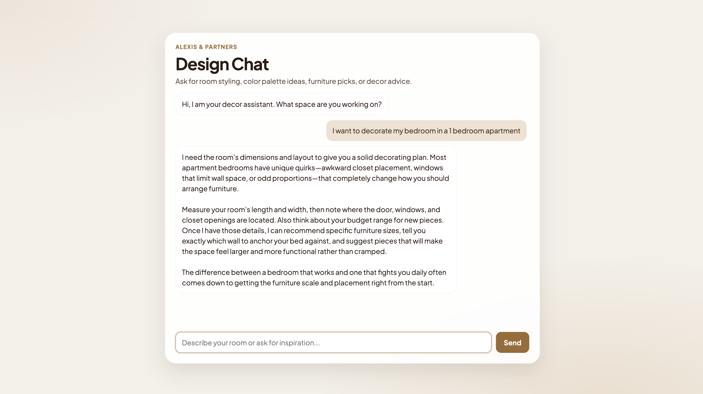

# Decor Agent

A production-grade LangGraph agent that gives confident, specific interior design advice. Built to demonstrate the LaunchDarkly AI iteration loop — AI Configs for runtime-managed prompts and models, progressive release, online evals, and observability.

> **🌀 Temporal version:** this project has been "Temporalized" — the same agent re-expressed as a durable, retryable, human-in-the-loop Temporal workflow. See **[TEMPORAL.md](TEMPORAL.md)** for the before/after architecture and runbook, and **[docs/TALK.md](docs/TALK.md)** for the presentation walkthrough.



## What it does

Users ask Decora, a senior interior design advisor, about colors, layouts, and trends. The agent routes each question to one of three specialist tools, synthesizes a short opinionated response, and returns it alongside rich metadata for observability.

Example questions:

- "What paint color works with dark oak floors?" → `style_advisor`
- "I have a 12x14 living room with a $2000 budget" → `room_planner`
- "Is terrazzo still trending?" → `trend_spotter`
- "How do I make a small bathroom feel bigger?" → `room_planner`
- "Hello!" → direct response, no tool call

## Architecture

This repo ships **two** implementations of the same agent that run side-by-side:

- **Before — LangGraph** (`/api/chat`, the `/` UI): an in-process state machine. Described below.
- **After — Temporal** (`/api/temporal/*`, the `/temporal` UI): the same domain logic re-expressed as a durable, retryable, human-in-the-loop workflow. **See [TEMPORAL.md](TEMPORAL.md)** for the full Temporal architecture, the worker/workflow/activity breakdown, and the runbook.

### Before: the LangGraph graph

```
START
  ↓
input_guard        (length / PII / empty checks — deterministic)
  ↓
agent              (Claude with bound tools — picks a tool or responds directly)
  ↓
execute_tools      (ToolNode runs the selected tool, which makes its own specialist LLM call)
  ↓
error_handler      (bounded retry up to max_retries, then graceful fallback)
  ↓
agent              (loops back to synthesize the tool result)
  ↓
response_formatter (builds metadata sidecar: routed_to, tool_calls_made, tokens, latency)
  ↓
END
```

Each node is a checkpoint boundary, so a failure in `execute_tools` resumes from there on retry, not from the start.

### After: the Temporal application

```
client → Temporal Service (:7233, persists Event History)
              ↓  task queue "decor-agent"
         Worker (app/worker.py) hosts:
           • DecorAgentWorkflow   — deterministic orchestration (signals, query, durable wait, fan-out)
           • activities           — all LLM / side-effecting work, run in a ThreadPoolExecutor
```

The workflow is pure/deterministic; every side effect is an activity. Human approval is a durable `wait_condition` driven by `approve`/`reject`/`tweak_budget` **signals**, and a `snapshot` **query** powers the live status UI. Full detail in [TEMPORAL.md](TEMPORAL.md).

## Project layout

```
decor-agent/
├── app/
│   ├── config.py              # Pydantic-settings singleton
│   ├── logging.py             # structlog (JSON prod / console dev)
│   ├── state.py               # AgentState + metadata merge reducer
│   ├── prompts.py             # Four structured system prompts
│   ├── flags.py               # LaunchDarkly AI Configs integration
│   ├── llm.py                 # Claude client factory (shared by both versions)
│   │
│   │   # --- before: LangGraph ---
│   ├── graph.py               # Graph definition + run_agent()
│   ├── nodes/
│   │   ├── input_guard.py
│   │   ├── agent.py
│   │   ├── error_handler.py
│   │   └── response_formatter.py
│   ├── tools/
│   │   ├── style_advisor.py
│   │   ├── room_planner.py
│   │   └── trend_spotter.py
│   │
│   │   # --- after: Temporal ---
│   ├── workflow.py            # DecorAgentWorkflow — deterministic orchestration, signals, query
│   ├── activities.py          # @activity.defn functions — all LLM / side-effecting work
│   └── worker.py              # Worker process: registers workflow + activities (task queue "decor-agent")
│
├── server.py                  # FastAPI — /api/chat (before), /api/temporal/* (after), static /web
├── test_agent.py              # LangGraph end-to-end suite
├── test_workflow.py           # Temporal workflow tests (time-skipping, mocked activities)
├── generate_traffic.py        # Load generator
├── web/
│   ├── index.html / app.js    # "before" chat UI  (/)
│   └── temporal.html / temporal.js  # "after" durable UI  (/temporal)
├── TEMPORAL.md                # before/after architecture + Temporal runbook
├── docs/
│   ├── TALK.md                # presentation talking points
│   └── *.png                  # README assets
├── requirements.txt
└── .env.example
```

## Quickstart

```bash
python -m venv venv && source venv/bin/activate
pip install -r requirements.txt
cp .env.example .env           # then edit to add ANTHROPIC_API_KEY
python server.py               # starts on http://localhost:8000
```

Open `http://localhost:8000/docs` for the interactive Swagger UI, or hit the API directly:

```bash
curl -X POST http://localhost:8000/api/chat \
  -H 'Content-Type: application/json' \
  -d '{"message": "What color goes with walnut floors?"}'
```

### Running the Temporal version

The Temporal "after" needs two more processes (the dev server and a worker). Full runbook — including the crash/durability demo — is in **[TEMPORAL.md](TEMPORAL.md)**. Short version:

```bash
temporal server start-dev          # terminal 1 — dev server + Web UI (:8233)
python -m app.worker               # terminal 2 — hosts workflow + activities
python server.py                   # terminal 3 — API + /temporal UI
```

## Run the test suite

```bash
LOG_LEVEL=WARNING python test_agent.py     # LangGraph (before)
python -m pytest test_workflow.py -v       # Temporal workflow (after) — no API key / server needed
```

## Environment

| Variable | Default | Purpose |
|---|---|---|
| `ANTHROPIC_API_KEY` | _required_ | Claude API key |
| `LD_SDK_KEY` | `""` | LaunchDarkly server SDK key (used by `flags.py` AI Configs) |
| `LOG_LEVEL` | `INFO` | structlog level |
| `ENVIRONMENT` | `development` | Switches log format between console and JSON |

## Production hygiene

- **Input validation** at two layers — Pydantic on the HTTP boundary, `input_guard` inside the graph
- **Bounded retries** — `max_retries=2`, then a graceful fallback message
- **Structured logs** on every step: `input_guard.pass`, `agent.invoke`, `tool.invoke/success/error`, `error_handler.retry/exhausted`, `http.request`
- **Metadata sidecar** on every response: `routed_to`, `tool_calls_made`, token usage, per-node latency, error counts — ready to feed evals and analytics
- **Errors never leak** to the client; full tracebacks go to logs only
- **Request IDs** honored from `x-request-id` header or generated per request

## Tech stack

Python 3.12+ · LangGraph · LangChain · Anthropic Claude · **Temporal (Python SDK)** · FastAPI · Pydantic · structlog · LaunchDarkly (server SDK + AI SDK)

## Notes & trade-offs

The Temporal version makes a few deliberate design choices (sync activities + thread-pool executor for the blocking LLM calls; no `heartbeat_timeout`/handler-drain, with reasons) — these are documented in the **[TEMPORAL.md](TEMPORAL.md)** "Sync activities" and "Design decisions & trade-offs" sections.
