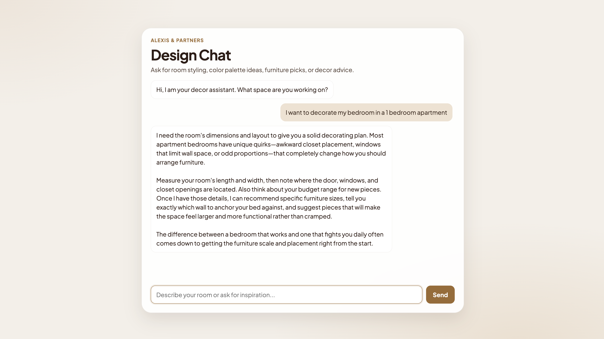

# Decor Agent (Decora)

An MCP-first interior design agent. Decora furnishes a room from a real catalog, writes the job to a design project, and stops for human approval before anything is committed.

This is not a chat wrapper. The model does not invent SKUs or keep the spec in conversation history. The world lives on an MCP server; the Decor app is a host that discovers tools, reads resources, and lets you approve the cart.



Built against the [Agentic AI Foundation](https://aaif.io/) MCP standard. Why each slice exists is in [`docs/aaif-learning.md`](docs/aaif-learning.md).

## What it does

You describe a room, budget, and constraints. Decora searches seeded inventory, updates `project://{context_key}`, and calls `request_approval` when the spec covers the room and the budget holds. You approve or reject in the UI. Draft items stay draft until you do.

Example jobs:

- "12x14 living room, $2000, keep grandma's credenza"
- "What paint from the catalog works with dark oak floors?"
- "Add a sofa under $1200 and pause for approval"

Old specialist prompts (`style_advisor`, `room_planner`, `trend_spotter`) are still in the tree. `/api/chat` does not use them.

## Architecture

```
Host (FastAPI + web/)
  chat UI + project panel
  harness: observe → tools/list → model → tools/call → stop for approval
  MCP client
        │
        │  JSON-RPC (in-process Client, or stdio for Inspector)
        ▼
Server (mcp_servers/decor_design.py)  — no Claude
  tools:     search_catalog, update_project, request_approval
  resources: project://{context_key}, catalog://sku/{sku}
  prompts:   plan_room (user-invoked)
        │
        ▼
World: seeded catalog + in-memory project store
```

| Primitive | Who controls it | In this repo |
|---|---|---|
| **Tools** | Model | Search inventory, mutate the project, ask to commit |
| **Resources** | Host / app | Read the project and a SKU without a tool call |
| **Prompts** | User | `plan_room` — room, budget, keep, avoid |

The model cannot call `approve`. That is a host route on purpose.

## Project layout

```
decor-agent/
├── mcp_servers/decor_design.py   # MCP environment (tools, resources, prompts)
├── app/
│   ├── catalog.py                # Seeded SKUs — if it is not here, it does not exist
│   ├── project.py                # Brief, rooms, spec list, budget, approval
│   ├── store.py                  # In-memory projects keyed by context_key
│   ├── harness.py                # Host loop: discover tools, call MCP, read project://
│   ├── prompts.py                # Decora system prompt (not plan_room)
│   ├── graph.py                  # Legacy specialist graph — unused by /api/chat
│   └── tools/                    # Legacy LLM “tools” — unused by /api/chat
├── server.py                     # FastAPI: /api/chat, /api/project, approve, reject
├── web/                          # Chat + project panel
├── test_catalog.py
├── test_store.py
├── test_mcp_catalog.py
├── test_mcp_project.py
├── test_harness.py
├── test_agent.py                 # Live LLM e2e (needs ANTHROPIC_API_KEY)
├── docs/aaif-learning.md
└── .env.example
```

## Quickstart

```bash
python -m venv venv && source venv/bin/activate
pip install -r requirements.txt
cp .env.example .env           # then add ANTHROPIC_API_KEY
python server.py               # http://localhost:8000
```

Open the chat UI and give Decora a room. The right-hand panel is `project://`, not a second transcript.

```bash
curl -X POST http://localhost:8000/api/chat \
  -H 'Content-Type: application/json' \
  -d '{"message": "Plan a 12x14 living room with a $2000 budget"}'
```

Host-only (the model cannot hit these):

```bash
curl 'http://localhost:8000/api/project?context_key=demo'
curl -X POST http://localhost:8000/api/project/approve \
  -H 'Content-Type: application/json' \
  -d '{"context_key": "demo", "kind": "spec"}'
```

## Inspect the environment with no LLM

The MCP server is usable without the chat app:

```bash
python mcp_servers/decor_design.py
```

Or open [MCP Inspector](https://modelcontextprotocol.io/docs/develop/build-server):

```bash
npx @modelcontextprotocol/inspector python mcp_servers/decor_design.py
```

Then `tools/list`, `resources/read` on `project://demo` or `catalog://sku/ART-SOFA-721`, and `prompts/get` `plan_room`.

## Tests

No API key needed for the protocol and store tests:

```bash
python test_catalog.py test_store.py test_mcp_catalog.py test_mcp_project.py test_harness.py
```

Live routing against Claude:

```bash
LOG_LEVEL=WARNING python test_agent.py
```

## Environment

| Variable | Default | Purpose |
|---|---|---|
| `ANTHROPIC_API_KEY` | _required for chat_ | Claude API key (not required for Inspector or MCP unit tests) |
| `ANTHROPIC_WORKSPACE_ID` | `""` | Required if the key is not scoped to one Anthropic workspace |
| `LD_SDK_KEY` | `""` | LaunchDarkly server SDK key (unused for the MCP loop) |
| `LOG_LEVEL` | `INFO` | structlog level |
| `ENVIRONMENT` | `development` | Console vs JSON logs |

Unknown `.env` keys are ignored so leftover Temporal-era variables do not crash settings.

## What's next (not in this tree)

AAIF build order after MCP + this host:

1. Point [goose](https://block.github.io/goose/) at `decor-design` (manual check — if goose cannot furnish a room, the server is not done)
2. `AGENTS.md` — stop conditions and consent, once the agent exists
3. A2A — e.g. a retailer agent for stock
4. agentgateway — only when there is more than one thing to front
5. LaunchDarkly — gate work that is already real

Temporal (API World durable-workflow demo) lives on [`temporal-api-world`](https://github.com/arober39/decor-agent/tree/temporal-api-world) and `durable-workflows`, not on `main`.

## Tech stack

Python 3.12 · MCP Python SDK (`MCPServer`) · Anthropic Claude · FastAPI · Pydantic · structlog
