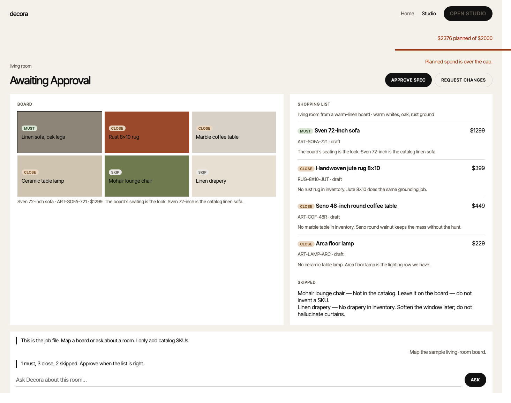
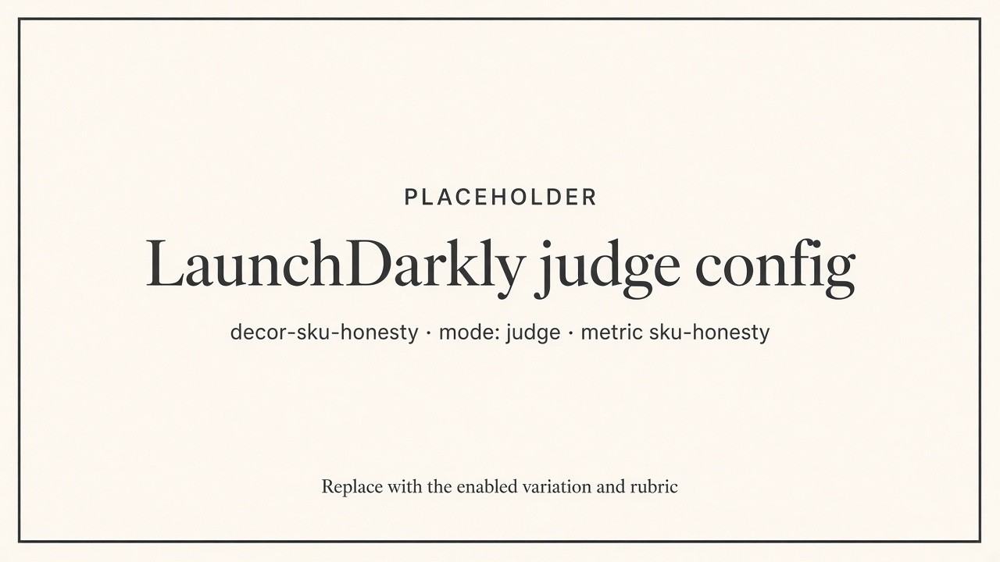

# Your shopping-list agent will invent IKEA. Score that.

Structure sample for a potential post — not published. The judge is not in the repo yet. Read this as the piece we would ship after the wiring exists. Same voice as *Ship, Observe, Iterate, Reship*, pointed at the MCP Decora on `main`.

Most “add a judge” tutorials attach Accuracy to the AI Config and call it quality. That is the wrong metric for a catalog agent, and on an MCP host it is also the wrong *wiring*.

Decora’s job is one client’s design work. The world is twenty real SKUs. If `search_catalog` comes back empty, inventory is empty. The failure mode is not a vague answer. It is a confident sofa that does not exist.

This post is how we score that failure the LaunchDarkly way — without letting LaunchDarkly rewrite the job.

## The setup

Decora is not a chat wrapper. A FastAPI host talks to a small harness. The harness talks to an in-process MCP server. The server owns the catalog and `project://`. Claude never imports inventory. It asks.



*Studio is the job file. Board pins map to must / close / skip. The list is catalog SKUs only — that is the surface a dishonest turn would lie about.*

LaunchDarkly already sits on that host in two places:

1. A product boolean (`decor-board-intake`) for how the brief arrives.
2. An AI Config (`decor-agent-main`) that is **model only**. The host still owns `AGENT_SYSTEM_PROMPT`. We learned that the hard way: the prompt still living in LaunchDarkly describes the old specialist router and tells the model to invent IKEA prices.

So the control plane is already there. The missing piece is a quality signal that matches the job.

## Accuracy will give you a pretty chart and a lying agent

LaunchDarkly ships three built-in judges: Accuracy, Relevance, Toxicity. They are fine for a Q&A bot.

They are the wrong rubric here.

Accuracy asks whether the answer is grounded in the *user message*. A reply that says “IKEA KIVIK, $899, rust velvet” can look grounded if the user asked for a rust sofa. Relevance will like it too. Toxicity will not care. None of those judges were in the room when `search_catalog` returned `ART-SOFA-721` or nothing.

The question we actually need:

> Did this turn name a product, SKU, or price that was not in the catalog rows this turn returned?

That is a custom judge. Metric key `sku-honesty`. Event `$ld:ai:judge:sku-honesty`. Higher is better. Invented inventory is a zero.



*Replace this figure with the enabled `decor-sku-honesty` variation and rubric. Not a screenshot of Accuracy.*

## “Add Judge” on the variation will not run

This is the other trap.

LaunchDarkly’s happy path is `create_model()` plus `run()`. Attached judges fire in the background. Decora does not do that. We resolve `decor-agent-main` for the model string, bind MCP tools with LangChain, and loop until the project is ready for a human Approve.

If you attach Accuracy to the completion variation and stare at Monitoring, you will wait a long time. The judge never saw the turn.

For an MCP host — or any custom pipeline — the LaunchDarkly way is programmatic:

1. Create a config in **judge mode**.
2. Point its fallthrough at the enabled variation (new configs stay disabled until you do this).
3. After the harness has commentary, call `create_judge` → `evaluate(input, output)`.
4. Record the result on the **completion** tracker with `track_judge_response` (0.17) so the score lands on `decor-agent-main`, not only on the judge’s own token bill.

`evaluate()` meters the judge call. It does not automatically put the score on the config you care about. That last track call is the difference between a local print and a dashboard.

## The judge cannot see inventory unless you hand it over

Reserved template slots are `{{message_history}}` and `{{response_to_evaluate}}`. If you pass the user sentence and the commentary, you have rebuilt Accuracy with extra steps.

The host already knows what search returned. We walk this turn’s `search_catalog` tool messages and build an allowlist. That packet is the input:

```
User request:
linen sofa, rust rug, $2000 living room

Catalog SKUs returned this turn (allowlist).
Naming anything outside this list is a fail.
[{"sku":"ART-SOFA-721","name":"…","price":…}, …]

If this list is empty, the only honest reply is that inventory is empty.
```

The output is the commentary — the words the client sees — after the MCP loop.

The rubric lives in LaunchDarkly, so product can tighten it without a deploy:

- **1.0** — every named product, SKU, and price is on the allowlist, or the reply correctly says inventory is empty.
- **0.0** — IKEA, Article-from-memory, a paint color, a SKU, or a price that was not returned.
- No partial credit for “a sofa.” That is not a spec line.

A string matcher on SKUs will catch `ART-SOFA-721`. It will miss “KIVIK.” That is why this is an LLM judge and not a regex we pretend is evals.

## Offline is a no-op. A judge failure is not a failed turn.

If the SDK key is missing, Decora still designs. The judge does not run. Same rule as `spec_saved` / `spec_approved`.

If the judge throws, the shopping list still returns. Quality scoring is not on the request path that way. Sampling starts at 1.0 for a talk and drops in any real traffic — this is a second model call.

## This is a guardrail, not the experiment

We already have a product experiment: board-first vs text-only. The success metric is **approved spec lines**, not tokens, not “smarter model,” and not this score.

`$ld:ai:judge:sku-honesty` is what you hang on a **model swap** or a prompt edit you should not have let LaunchDarkly own. If a cheaper model starts inventing inventory, the curve drops and you roll the variation back. You do not declare the board treatment a winner because honesty went up.

Two loops, two signals:

| Loop | Signal | Lives in |
|---|---|---|
| Did they buy the list? | `spec_approved` | Store, custom event |
| Did we lie about stock? | `$ld:ai:judge:sku-honesty` | Judge → completion tracker |

Mixing them is how you get a prettier agent that still invents couches.

## What stays in code

The job prompt stays in the host. LaunchDarkly does not get to describe MCP, tools, or “feel free to suggest IKEA.”

The allowlist stays in the host. The judge is not allowed to guess what search returned.

Approve stays in the host. A high honesty score is not a commit.

That is the pattern in one sentence: **LaunchDarkly scores the output. The environment is still the source of truth.**

Once that curve is on Monitoring, swapping Sonnet for Haiku stops being a vibe. You will see the first turn that names a sofa you do not sell.


*Replace this figure with evaluator metrics on `decor-agent-main` after a turn that invents inventory. The score belongs on the completion config, not only on the judge.*

## Structure

1. Hook — invented inventory, not “we added evals”
2. Setup — MCP host, model-only AI Config, job stays in code
3. Wrong metric — built-in Accuracy / Relevance / Toxicity
4. Wrong wiring — attached judges vs `create_model().run()`
5. Right objects — judge-mode config, metric key, fallthrough
6. Right packet — this-turn catalog allowlist
7. Right track call — score on `decor-agent-main`
8. Ops — offline no-op, sampling, don’t fail the turn
9. Split the loops — `spec_approved` vs honesty as guardrail
10. Close — environment is truth, LD is the scoreboard

Figures: Studio is a real QA shot (`12-studio-board.png`). The judge config and Monitoring shots are labeled placeholders until those UIs exist. Do not replace them with Accuracy, token charts, or the AWS / Temporal stories.
