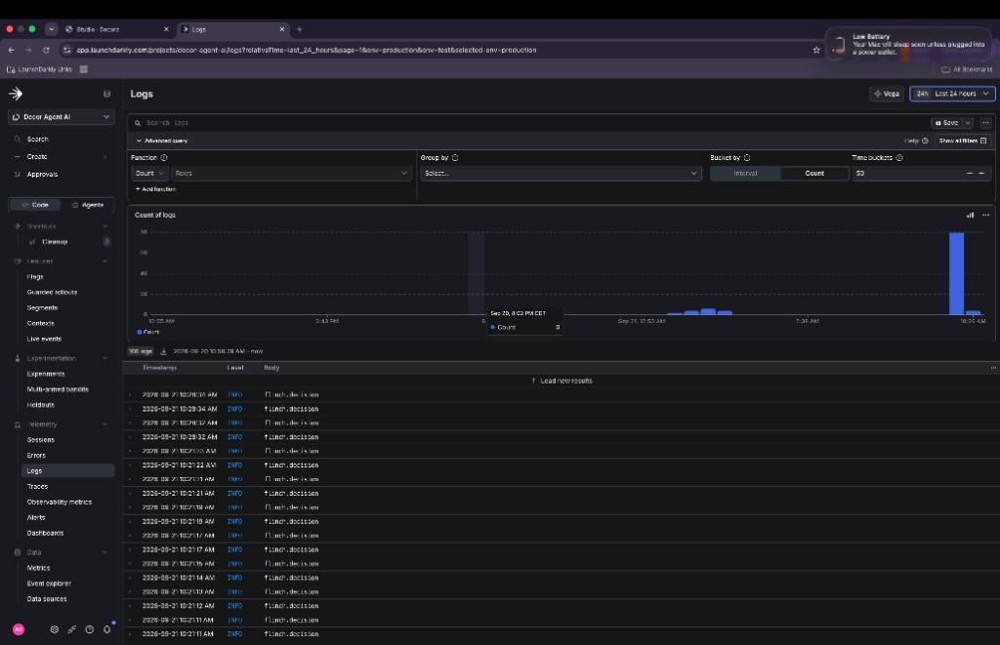
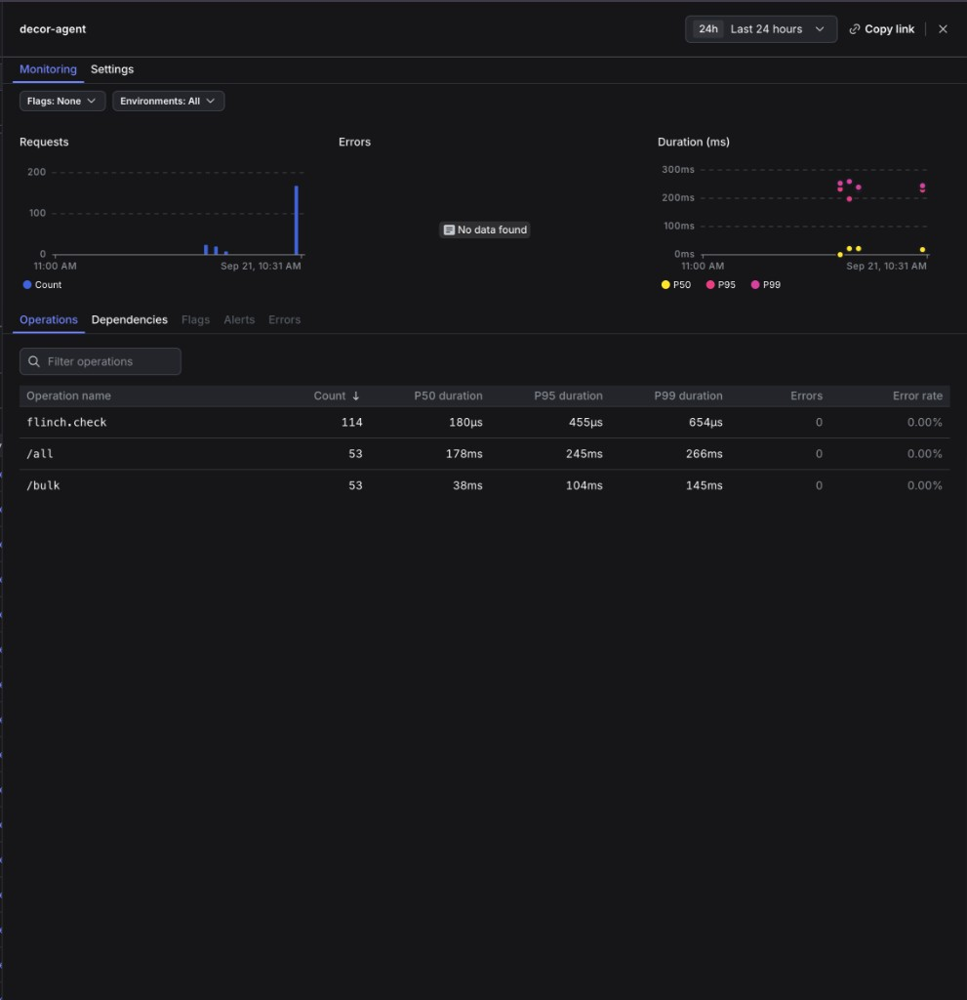

# Building the Agent Flinch with Jev and LaunchDarkly

Two things happened over the weekend. I got access to Jev, and I came across [a post from Biswa G Singh](https://www.linkedin.com/feed/update/urn:li:activity:7506770570856947712/), co-founder of ZeonAI Labs, about a coding agent that deleted his team's dev vector database.

The diagnosis behind the delete was right. A bad import had left a local test cluster on the wrong schema, so wiping the collection and re-importing was a reasonable repair.

The port the agent used had been a tunnel to the shared dev environment for the entire session. Minutes earlier it had run read-only queries through that same port, so it filed the number away as local and never checked again.

What stayed with me was his point that a tired human at 11pm still hesitates before typing DELETE against something that might be shared. The agent had the same information and none of the hesitation.

He called that missing pause the flinch, and with Jev in hand I wanted to see what building one takes under the assumption that reasoning is cheap and accountability isn't.

His team made three changes the same day. No destructive operation runs without a human confirming the target, shared environments never sit inside an agent's working session, and read-only is enforced by access control rather than by an instruction in a prompt.

The [Decora](https://github.com/arober39/decor-agent) chat path already keeps shared-dev behind a read-only key. The coding-agent path is where a full-access key and a local-looking port can still meet, so that is where the pause has to live, and where the other two fixes become checks the host can run.

## What Jev is

Jev is TypeSafe's System One model. Instead of writing a paragraph, it answers typed questions over a state you hand it and returns calibrated confidence with each answer.

A noul is a yes-or-no question that comes back as a probability, and a choice is a pick from a fixed list that comes back with a confidence score. That shape is what makes it usable as a judge in front of a tool call, since code can compare a number to a threshold and cannot do much with prose.

I called it through the TypeSafe SDK and pinned the version. The model is also reachable through Vercel AI Gateway and OpenRouter.

The check I ended up with has three layers, and none of them trusts the other two.

| Layer | What it does | Where it's configured |
|---|---|---|
| Deterministic check | Resolves host and port to an environment, classifies the command, applies policy | `environments.yaml` plus the `flinch-policy` flag |
| Jev check | Scores the same state with typed yes-or-no answers and one choice | The `flinch-jev` flag |
| Human confirmation | Requires the resolved environment name as the approval token | A host-only argument, `--i-approve-target` |

## Reproducing the incident

In order to reproduce the same issue, I added semantic search to an interior design agent I'm working on called [Decora](https://github.com/arober39/decor-agent). It allows users to search a furniture catalog by vibe, pin pieces to a board, and ask for a plan.

I stored the catalog in a vector database, the same class of system the incident hit. Changing the embedding model changes the vector size, and changing the vector size means dropping the collection and rebuilding it. That rebuild is the legitimate maintenance task where a confident agent can aim at the wrong cluster.

The setup is two Qdrant containers on one laptop, both from a single Docker Compose file. `local-test` on 6333 is allowed to be broken, and `shared-dev` on 6335 holds the 69-point catalog the running app searches.

A socat tunnel forwards 6334 to shared-dev, so the dangerous port sits next to the safe one and looks just as local. The agent that talks to Decora through MCP holds a read-only key on shared-dev, so the chat path cannot delete anything.

The coding-agent path that fixes schema is the one that can still hold a full-access key and a URL that happens to end in 6334.

A registry file maps every address, including the tunnel, to a name and a sensitivity, and it tags every command the agent can run as read-only, write, or destructive. Every layer that follows reads this file:

```yaml
# environments.yaml (excerpt)
environments:
  - name: local-test
    hosts: ["localhost:6333", "127.0.0.1:6333"]
    sensitivity: local
  - name: shared-dev
    hosts: ["localhost:6335", "127.0.0.1:6335"]
    sensitivity: shared
  - name: shared-dev-tunnel
    hosts: ["localhost:6334", "127.0.0.1:6334"]
    sensitivity: shared
    notes: "Looks local. Forwards to shared-dev."

tools:
  - name: qdrant.collections.get
    kind: read-only
    match: "GET /collections"
  - name: qdrant.collection.delete
    kind: destructive
    match: "DELETE /collections/{name}"
```

To recreate the broken state, seed local-test with a collection at the wrong vector size. The seed script refuses any environment other than local-test:

```bash
python scripts/seed_broken_local_test.py --environment local-test
# target=local-test url=http://localhost:6333 size=768
```

The reproduction script aims the same two calls at the tunnel, a GET on 6334 followed by a DELETE on that same port, while the stated intent is still "fix the broken schema on local-test." It always runs the flinch check now.

The unguarded fact is the identity it prints first. Intended local-test, actual `shared-dev-tunnel`, `would_destroy_shared` true. Default is a dry run, so the DELETE is never sent.

```bash
python scripts/repro_flinch_baseline.py
```

```json
{
  "intended_target": "local-test",
  "actual_environment": "shared-dev-tunnel",
  "actual_url": "http://localhost:6334",
  "sensitivity": "shared",
  "would_destroy_shared": true
}
```

The diagnosis of a broken schema is sound, and a collection delete is the right repair when the target is local-test. The miss is identity. A live `--execute` against that port, if the check ever allowed it, would wipe shared-dev.

## Step 1: Create the policy flag

With the gap between reasoning and accountability proven, the policy that closes it needs a home outside the code, and LaunchDarkly plays that part for the rest of this build.

It holds the policy as a JSON flag, so the check tightens or loosens without a deploy. It holds the judge's model pin and question text the same way, so the wording can change without touching the app.

Custom metrics and a guarded rollout decide when the check moves from watching to enforcing. Each check also writes a `flinch.decision` log. That is the control layer around the agent, and the flag is only the first piece of it.

I created a multivariate JSON flag, `flinch-policy`, in the existing `decor-agent-ai` project. I did that from a chat connected to the LaunchDarkly MCP server. The prompts that created the flags live in [flinch-mcp-prompts.md](flinch-mcp-prompts.md). What matters here is the three variations.

`fail-closed` is the off variation and the SDK default.

```json
{
  "mode": "live",
  "on_ld_error": "confirm",
  "destructive": {
    "local": "confirm",
    "shared": "block"
  }
}
```

`shadow` computes the pause and does not enforce it.

```json
{
  "mode": "shadow",
  "on_ld_error": "confirm",
  "destructive": {
    "local": "allow",
    "shared": "confirm"
  }
}
```

`live` is the first time `enforce` is true. Shared destructive work is still confirm, never allow.

```json
{
  "mode": "live",
  "on_ld_error": "confirm",
  "destructive": {
    "local": "allow",
    "shared": "confirm"
  }
}
```

Production targeting is on. The default rule started on `shadow`.

The three variations differ in two places. `mode` is `shadow` or `live`, and `destructive.shared` is confirm or block. No variation is allowed to serve `allow` for shared destructive work, and the code treats a variation that tries as `confirm`.

If LaunchDarkly is unreachable or the JSON is garbage, the in-code default is `fail-closed`, so the app does not fail open.

```python
# app/flags.py
FLINCH_POLICY_DEFAULT = {
    "mode": "live",
    "on_ld_error": "confirm",
    "destructive": {"local": "confirm", "shared": "block"},
}
```

## Step 2: Pin the Jev model in its own flag

The second flag is a config bag for the Jev check, `flinch-jev`, and it pins the model to `jev-1.13.0`. Same MCP chat, second prompt, same appendix.

Production serves `pinned`. A `preview` variation exists so `jev-latest` can be tried against a test context. The default rule and the off variation both serve `pinned`, so production never sees a floating model.

```json
{
  "model": "jev-1.13.0",
  "choice_confidence_min": 0.72,
  "questions": {}
}
```

I added the TypeSafe key to the environment file.

```bash
# .env
TYPESAFE_API_KEY=your-key-here
```

The app does not call Jev until step 6. Wiring the key first means the later step is a code change and nothing else.

## Step 3: Define the Jev questions

The questions live in the `pinned` variation of `flinch-jev`, so the wording can change without a deploy. I added them in the LaunchDarkly UI by editing the variation's JSON, and this is the object that fills the empty `questions` field from step 2:

```json
{
  "destructive": {
    "type": "noul",
    "instructions": "Is `command` a destructive action against stored data or cluster schema (delete collection, recreate collection, drop volume, wipe and re-import)? Read-only GET, search, and list are not destructive."
  },
  "target_shared": {
    "type": "noul",
    "instructions": "Could `resolved_target` be a shared or non-local environment? Treat sensitivity `shared`, hosts that are tunnels, and ports that forward to shared-dev as shared. `environment.notes` may say it looks local."
  },
  "intent_match": {
    "type": "noul",
    "instructions": "Does `resolved_target` match `stated_intent`? If the agent said local-test or localhost test cluster but `environment.name` is shared-dev or shared-dev-tunnel, or `recent_uses` show this same host was used without re-checking, the target does not match."
  },
  "action": {
    "type": "choice",
    "instructions": "Choose the next step for this tool call. Code will also apply policy; pick the option that fits this state.",
    "criteria": {
      "proceed": "Read-only, or a write that clearly targets the intended local environment with no shared/tunnel ambiguity.",
      "confirm_with_human": "Destructive or shared-target, or intent is ambiguous, or the same port was already used and now the action is stronger. A person should approve the target.",
      "block": "Destructive action on a shared or tunnel target, or the command would wipe data the agent did not name as the intended target."
    }
  }
}
```

All four go out in one request over the same state. A noul near 0.5 means Jev is unsure, and a choice confidence under 0.72 is treated as `confirm_with_human` even when the pick is `proceed`.

## Step 4: Build the state for each check

Both checks read the same named JSON, built by the host before the command runs. It carries the exact command, the stated intent, the resolved target, the registry row, and the recent uses of that host in this session.

For the DELETE in the reproduction, the state looks like this:

```json
{
  "command": "DELETE http://localhost:6334/collections/decor_catalog",
  "stated_intent": "Fix the broken decor_catalog schema on local-test",
  "resolved_target": {
    "host": "localhost:6334",
    "url": "http://localhost:6334",
    "collection": "decor_catalog"
  },
  "environment": {
    "name": "shared-dev-tunnel",
    "sensitivity": "shared",
    "hosts": ["localhost:6334", "127.0.0.1:6334"],
    "notes": "Looks local. Forwards to shared-dev."
  },
  "sensitivity": "shared",
  "recent_uses": [
    {
      "command": "GET http://localhost:6334/collections/decor_catalog",
      "environment": "shared-dev-tunnel",
      "kind": "read-only"
    }
  ]
}
```

The `recent_uses` field is the incident in miniature. The earlier GET on the same port is what made the agent confident, and here it is written down where a judge can see it.

## Step 5: Add the deterministic check

The first layer is ordinary Python that never calls Jev and never talks to Qdrant. It resolves the address to a registry row, classifies the command from the tools list, reads `flinch-policy`, and returns allow, confirm, or block:

```python
# app/flinch_check.py
def decide(state: dict, policy: dict | None = None) -> dict:
    sensitivity = state.get("sensitivity") or "shared"
    policy = policy or get_flinch_policy(
        str(state.get("context_key") or "flinch-baseline"),
        qdrant_sensitivity=sensitivity,
    )
    kind = classify_command(str(state.get("command") or ""))
    mode = policy.get("mode") or "live"
    if kind == "read-only":
        decision, reason = "allow", "read-only command"
    elif kind == "write":
        decision = "confirm" if sensitivity == "shared" else "allow"
        reason = f"write on {sensitivity} target"
    else:
        destructive = policy.get("destructive") or {}
        decision = destructive.get(sensitivity) or "confirm"
        if sensitivity == "shared" and decision == "allow":
            decision = "confirm"
        reason = f"destructive action on {sensitivity} target"
    if mode == "off":
        return {"layer": "deterministic", "mode": mode, "kind": kind,
                "sensitivity": sensitivity, "decision": "allow",
                "enforce": False, "reason": "policy mode off"}
    return {"layer": "deterministic", "mode": mode, "kind": kind,
            "sensitivity": sensitivity, "decision": decision,
            "enforce": mode == "live", "reason": reason}
```

The check lives in `app/flinch_check.py`. The MCP server stays model-free and never imports it.

Decora's chat harness runs `decide()` in front of every `tools/call`, including host-side persist that the model skipped. Search and other read-only catalog calls go through. Writes to the in-memory project store are tagged local, so they are not treated as shared-dev.

The reproduction script is the coding-agent stand-in for Qdrant DELETE, and it runs the same function before 6334. Jev still sits on that destructive path, not on every sofa search.

An agent that is very sure 6334 is local-test still has to get past a row that says otherwise.

## Step 6: Add the Jev check

Jev sits on the same state after the deterministic check, not instead of it. The backend loads the model, threshold, and questions from `flinch-jev` at runtime, calls TypeSafe, and maps the answer onto a suggestion the host can use:

```python
# app/jev_check.py
class TypeSafeJev:
    def evaluate(self, state: dict, config: dict) -> dict:
        from typesafe_sdk import TypeSafeClient

        model = (config.get("model") or "jev-1.13.0").strip()
        questions = config.get("questions") or {}
        if not questions:
            raise ValueError("flinch-jev questions are empty")
        key = get_settings().typesafe_api_key.strip()
        with TypeSafeClient(api_key=key or None, model=model) as client:
            response = client.system_one(state=state, questions=questions, model=model)
        nouls = {name: float(answer.noul) for name, answer in response.nouls.items()}
        picked = response.choices["action"]
        return {
            "source": "typesafe",
            "model": response.model or model,
            "nouls": nouls,
            "action": picked.choice,
            "confidence": float(picked.confidence),
            "suggested": _suggest(picked.choice, float(picked.confidence), config),
        }


def _suggest(action, confidence, config) -> str:
    threshold = config.get("choice_confidence_min", 0.72)
    if action not in {"proceed", "confirm_with_human", "block"}:
        return "confirm_with_human"
    if confidence is not None and confidence < float(threshold):
        return "confirm_with_human"
    return action
```

Typed output means Jev cannot return an invalid action. It can still pick the wrong valid one, which is why it is never the only safeguard.

The host keeps the last word, mapping policy plus scores onto allow, confirm, or block, and it logs the `model` field from every response so a version change shows up in the data.

If Jev is down or the confidence comes back empty, the policy still runs, and destructive or shared work stays on confirm.

The TypeSafe bill for this whole day, including the 40-key rollout loop later on, was 63 requests, 57,066 tokens, and $0.0021. A single flinch is one of those requests.

## Step 7: Build the human confirmation step

One pushback in the comments on Singh's post is the design brief for this step. A human confirming the target receives the same information the agent had, an address that looks right, and approves it for the same reason the agent ran it.

The fix is to resolve the address to an identity before asking, since a person flinches at a named shared cluster and not at a localhost port.

When the decision is confirm, the process does not accept a yes. It prints the command, the resolved environment, the URL, the sensitivity, the deterministic verdict, and the Jev scores, and then it asks for the environment name itself:

```text
flinch confirmation (approve the TARGET, not the action)
command: DELETE http://localhost:6334/collections/decor_catalog
stated_intent: Fix the broken decor_catalog schema on local-test
resolved_name: shared-dev-tunnel
hosts: ['localhost:6334', '127.0.0.1:6334']
url: http://localhost:6334
collection: decor_catalog
sensitivity: shared
deterministic: confirm (destructive action on shared target)
jev_model: jev-1.13.0 source=typesafe
jev_nouls: {"destructive": 0.98, "intent_match": 0.12, "target_shared": 0.95}
jev_action: block suggested=confirm_with_human confidence=0.31
type this environment name to approve: shared-dev-tunnel
```

Approval is a host argument, not a tool the model can call. Typing the name you meant fails when it isn't the name the registry resolved:

```bash
python scripts/repro_flinch_baseline.py --i-approve-target local-test
python scripts/repro_flinch_baseline.py --i-approve-target shared-dev-tunnel
```

```text
typed: "local-test"
target: "shared-dev-tunnel"
approved: false
approval refused: typed name does not match resolved target
```

```text
typed: "shared-dev-tunnel"
target: "shared-dev-tunnel"
approved: true
outcome: approved_dry_run
phase_b skipped (dry-run). Pass --execute to wipe shared-dev via 6334.
```

`local-test` is refused because the resolved name is `shared-dev-tunnel`. The matching name is accepted, logged with who and when, and the DELETE still does not go out.

A yes proves nothing. Naming the environment proves the person read the resolution.

## Step 8: Wire up telemetry

Every check writes one decision row and sends it two places. Four custom metrics feed the rollout in the next step, and LaunchDarkly Observability keeps the full record.

They are plain custom count metrics in the same project, and the `create-metric` tool on the MCP server takes these definitions as they are:

```json
[
  {"key": "flinch-check",    "name": "Flinch check",    "kind": "custom", "eventKey": "flinch_check",    "successCriteria": "HigherThanBaseline", "tags": ["flinch", "agent-guardrail"]},
  {"key": "flinch-block",    "name": "Flinch block",    "kind": "custom", "eventKey": "flinch_block",    "successCriteria": "LowerThanBaseline",  "tags": ["flinch", "agent-guardrail"]},
  {"key": "flinch-escalate", "name": "Flinch escalate", "kind": "custom", "eventKey": "flinch_escalate", "successCriteria": "LowerThanBaseline",  "tags": ["flinch", "agent-guardrail"]},
  {"key": "flinch-override", "name": "Flinch override", "kind": "custom", "eventKey": "flinch_override", "successCriteria": "LowerThanBaseline",  "tags": ["flinch", "agent-guardrail"]}
]
```

| Metric | Fires when |
|---|---|
| `flinch_check` | Every check, with environment, kind, outcome, Jev model, and whether code and Jev disagreed |
| `flinch_block` | The outcome is `blocked`, or `would_block` in shadow |
| `flinch_escalate` | The deterministic decision is confirm, or Jev suggests `confirm_with_human` |
| `flinch_override` | A human approved the target by name |

The Observability side is a `flinch.check` span and a `flinch.decision` log on the `decor-agent` service. Each row carries the command, the resolved environment, the deterministic decision, the Jev model and nouls, and the disagreement bit.

A clever agent can always tell a coherent story about why 6334 was fine. The useful artifact says which environment it actually had, which policy it evaluated, and whether anything stopped it.



*Production logs for service `decor-agent`, filtered to `flinch.decision`. These are the dry-run checks from the guarded-rollout traffic, including the refused and accepted target names. No DELETE was sent.*



*`flinch.check` ran 114 times in this window, P50 about 180µs, with no errors. `/all` and `/bulk` are Qdrant collection reads from those same dry-runs, not extra deletes.*

## Step 9: Roll out shadow to live

Both layers can now say confirm or block, which raises the question of when they are allowed to. A flag that can only be on or off makes a poor flinch, because you want to see the pause fire on the command before it is allowed to stop anything.

Shadow writes the same decision record live would have written, and live is the first time `enforce` is true.

Moving between them is a guarded rollout on `flinch-policy` in production, not a one-step flip of the default rule. On the flag's Targeting page, under the default rule, I chose Serve, then Guarded rollout, with these settings:

- Control is `shadow`, treatment is `live`, and the off variation stays `fail-closed`
- Target by `user`
- Stages of 10 percent for 15 minutes, then 50 percent for 15 minutes. A single stage cannot exceed 50 percent. If a stage stays healthy, LaunchDarkly can promote toward 100. A laptop demo does not supply that sample
- `flinch-escalate` as a rollback-and-notify metric, since the tunnel DELETE resolves to confirm, not block
- `flinch-override` monitored as well. A human typing the tunnel name on purpose is a different event from the check catching a miss

The tunnel DELETE in this scenario resolves to confirm, not block, so hanging rollback on `flinch-block` alone leaves you staring at an empty chart. Instrument the no that fires.

The first guarded release on this flag reverted to `shadow` for insufficient sample size. That is Guardian doing its job, not the flinch failing.

I started a second rollout and sent distinct context keys through the reproduction while it was still on the first stage.

```bash
for i in $(seq 1 40); do
  python scripts/repro_flinch_baseline.py --context-key "flinch-user-$i"
done
```

Most keys stayed on `shadow` with `enforce` false. A few landed on `live` with `enforce` true. Both still resolved the DELETE to confirm, and neither sent it.


*First stage of the second guarded rollout, 10% `live` / 90% `shadow`, four unique users on `live`. Escalate and override did not have enough sample to call a regression. The release was in progress. It had not promoted, paused, or rolled back yet. Completing Guardian would take far more distinct users than this loop.*

## What the gate is for

Agents are already good at the part this incident got right. They can read a 768-dimension collection sitting next to a 384-dimension one and propose a rebuild.

The expensive part is showing, after the fact, that the plan was aimed at the cluster you thought it was. That proof also has to cover a judge you can version scoring the same state, and the human who said yes naming the target instead of the action.

Execution will keep getting cheaper. The flinch is the part that has to stay yours.
